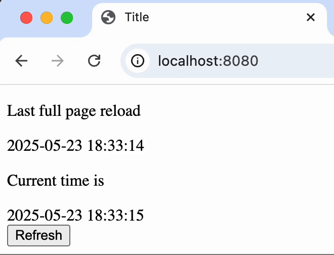

# 1) The Simplest Web Page

The simplest web page is just some data in HTML format transferred over the HTTP protocol and rendered in your browser. To implement this, we only need to create the data (stored in the `page` variable) and start an HTTP server that returns that data:

```go
var page = `
<!DOCTYPE html>
<html lang="en">
<head>
	<meta charset="UTF-8">
	<meta name="viewport" content="width=device-width, initial-scale=1.0">
	<title>Title</title>
</head>
<body>
	<h1>Heading 1</h1>
	<p>Paragraph</p>
</body>
</html>
`

func main() {
	http.HandleFunc("/", Handler)
	log.Fatal(http.ListenAndServe(":8080", nil))
}

func Handler(w http.ResponseWriter, r *http.Request) {
	w.Write([]byte(page))
}
```

# 2) `html/template`

That's nice and simple. But feels kind of hardcoded, static... What if we want some part of the page to change? We can use [html/template](https://pkg.go.dev/html/template) to add variables to the page:

```html
<!-- from 2/page.html -->

<body>
	<p>{{.Paragraph}}</p>
</body>
```

In this case, the variable part is `{{.Paragraph}}`. Here's how we fill it in:

```go
// from 2/main.go

type Page struct {
	Paragraph string
}

func Handler(w http.ResponseWriter, r *http.Request) {
	templ := template.Must(template.ParseFiles("page.html"))
	p := Page{
		Paragraph: time.Now().String(),
	}
	err := templ.Execute(w, p)
	if err != nil {
		http.Error(w, err.Error(), http.StatusInternalServerError)
	}
}
```

Before sending the page to the browser (or other HTTP client), we replace `{{.Paragraph}}` in data from the `page.html` with the current time. Cool!

However, to refresh the time, we need to reload the whole page. What if we don’t want to do that? What if we want to refresh just part of the page — the variable part? This is called AJAX (Asynchronous JavaScript and ~~XML~~ — it’s mostly JSON these days) in web parlance. AJAX allows your web page to communicate with the server without a full reload. It's commonly used in modern web apps for smooth, dynamic user experiences.

# 3) HTMX

Enter HTMX. Finally. HTMX simplifies AJAX-like behavior using just HTML attributes — no JavaScript required!

First, add these into `page.html`:

```html
<script src="https://unpkg.com/htmx.org@2.0.4"></script>

<body>
	<p>Last full page reload</p>
	{{.FullReloadTime}}

	<p>Current time is</p>
	<div id="result">{{.FullReloadTime}}</div>

	<button 
		hx-get="/time" 
		hx-target="#result" 
		hx-swap="innerHTML">
		Refresh
	</button>
</body>
```

* The `<script>` tag includes the HTMX library from a CDN.
* `hx-get="/time"` makes a GET request to `/time`.
* `hx-target="#result"` injects the response into the `<div>` with `id="result"`.
* `hx-swap="innerHTML"` replaces the content inside that div.

We also need to implement the handler for the `/time` path:

```go
http.HandleFunc("/time", TimeHandler)

func TimeHandler(w http.ResponseWriter, r *http.Request) {
	fmt.Fprint(w, time.Now().String())
}
```

Now, when you reload the page in your browser, both timestamps will update. But if you click the **Refresh** button — thanks to HTMX — **only the bottom timestamp updates**:


